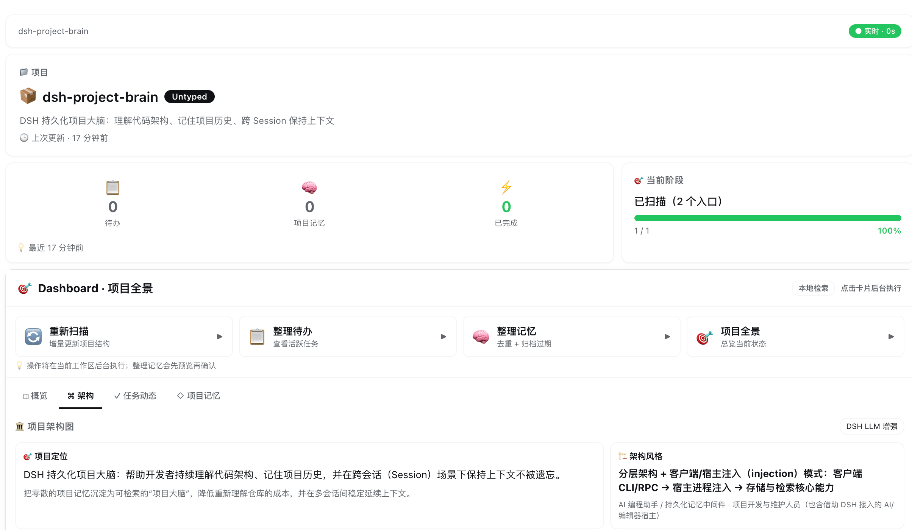
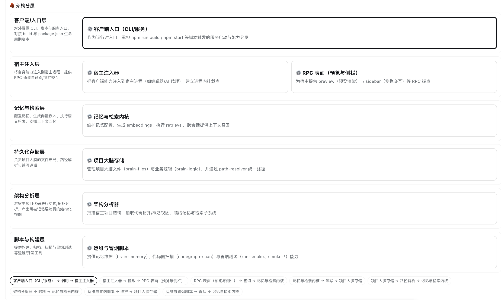
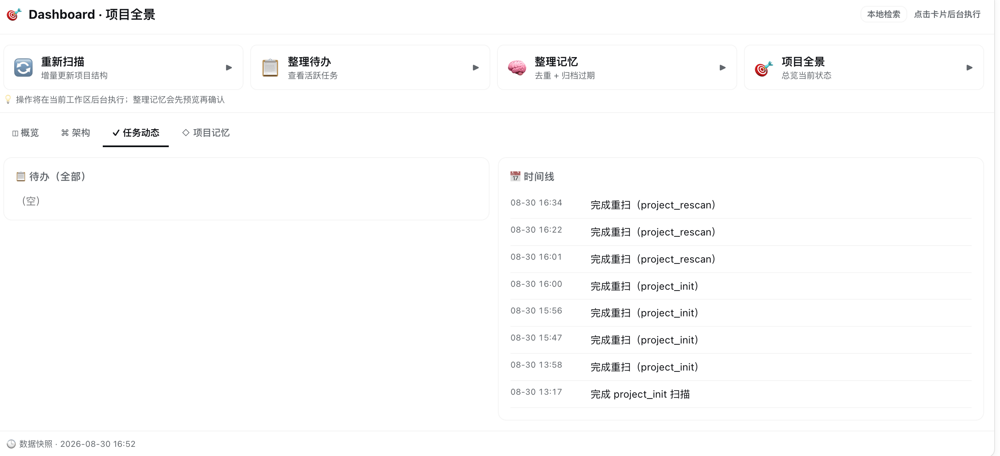

# dsh-project-brain

**English** · [简体中文](./README.zh-CN.md)

[](./CHANGELOG.md)
[](./LICENSE)
[](./package.json)
[](./RELEASE_CHECKLIST.md)

**A persistent project brain for DSH Desktop.** It analyzes the active workspace, explains the architecture, preserves decisions and development history, and restores the right context in future sessions.

Instead of making every new conversation rediscover the repository, dsh-project-brain stores structured knowledge inside the project itself and keeps getting more useful as the project evolves.

> Current release: `0.7.0-beta.1`. The core workflows, release build, isolation checks, and privacy checks pass automatically. Broader real-world DSH Desktop testing is still in progress.

[GitHub release](https://github.com/yj-liuzepeng/dsh-project-brain/releases/tag/v0.7.0-beta.1) · [DSH community showcase](https://github.com/deepseek-ai/deepseek-harness/discussions/5121) · [MyDSH listing](https://mydsh.dev/plugin?repo=yj-liuzepeng%2Fdsh-project-brain)

## Preview

### Project dashboard and architecture report



### Conceptual architecture layers



### Work, TODOs, and project timeline



## Why use it?

AI coding sessions are usually short-lived, while real software projects are not. Important context gets scattered across conversations: why an architectural choice was made, which workaround fixed a production bug, what is currently in progress, and which files form the critical path.

dsh-project-brain turns that context into a local, workspace-scoped knowledge layer:

- **Understand a repository quickly** — detects languages, frameworks, tooling, entry points, manifests, README metadata, symbols, and imports.
- **Explain architecture, not just folders** — produces a report covering project purpose, architectural style, conceptual layers, component responsibilities, relationships, runtime flows, key files, reading order, and risks.
- **Reuse the active DSH model** — architecture analysis uses the provider/model already selected for the current DSH Session; no separate chat-model key is required.
- **Remember across conversations** — decisions, requirements, architecture notes, bugs, lessons, changes, TODOs, and timeline events persist in the workspace.
- **Restore context automatically** — a new Session receives high-value memories, active TODOs, and recent activity through the DSH system prompt.
- **Keep workspaces isolated** — the Host resolves the live Session workspace; one project's memory is never guessed from another project.
- **Work without embeddings** — local BM25 retrieval is the zero-configuration default. OpenAI-compatible embeddings are an optional semantic upgrade.
- **Stay usable when AI is unavailable** — architecture generation and memory retrieval have local fallback paths.

## How it works

```text
Active DSH Session
       │ trusted live Session cwd
       ▼
Workspace scanner ───────► project facts and source evidence
       │
       ├──► current DSH LLM ───► semantic architecture report
       │          │ unavailable / timeout / invalid output
       │          └────────────► local architecture fallback
       │
       ├──► .project-brain/ ───► memory, TODOs, timeline, architecture
       │
       ├──► context injector ──► next Session system prompt
       │
       └──► Connection RPC ────► Dashboard and TodoStrip
```

The browser-side UI cannot choose arbitrary filesystem paths. Runtime actions are resolved by the Host against the active DSH Session.

## Local project data

Each workspace owns its data:

```text
.project-brain/
├── project.json          # project metadata, stack, languages, and entry points
├── architecture.json     # purpose, layers, components, flows, and evidence
├── memory.jsonl          # long-term structured project memories
├── todo.jsonl            # project tasks and status
├── timeline.jsonl        # scans, memory events, TODO events, and sessions
├── codegraph.json        # optional legacy AST graph
└── cache/
    └── embeddings.jsonl  # optional, derived, and safe to rebuild
```

Project data survives plugin upgrades and conversation changes. Uninstalling the plugin does not delete `.project-brain/`.

## Memory model

Memories can represent `decision`, `requirement`, `architecture`, `change`, `bug`, `lesson`, `issue`, or `context`.

Every new V2 memory includes importance, confidence, lifecycle status, source, timestamps, optional tags, and related files. Archived, superseded, and deleted memories are excluded from normal retrieval, automatic prompt injection, status counts, and the Dashboard.

The plugin writes memories through three paths:

1. The Agent records durable decisions and lessons with `project_memory_add`.
2. Session shutdown records a deduplicated Git change summary for initialized projects.
3. Architecture-diff analysis can generate architecture/change memories.

The **Organize Memory** action first previews merge and archive candidates. It only writes changes after confirmation.

## Retrieval

The default local retriever uses BM25 over titles, content, tags, related files, and types. Ranking also considers importance, confidence, recency, stable memory types, and result diversity.

Optional hybrid retrieval combines keyword and vector scores. Enable it in the plugin settings:

```yaml
retrievalMode: hybrid
vectorEnabled: true
embeddingBaseURL: https://your-provider.example/v1
embeddingModel: your-embedding-model
embeddingApiKeyEnv: PROJECT_BRAIN_EMBEDDING_API_KEY
```

Embedding indexes are updated lazily by content hash. Missing credentials, network errors, invalid vectors, or dimension mismatches automatically fall back to local keyword retrieval.

> Enabling a remote embedding service sends memory titles, content, tags, and related file names to that service. Use a local model or a trusted provider for confidential repositories.

## Architecture analysis

Initialization and rescans first collect deterministic local facts. When the current DSH Session has an available model route, the plugin sends bounded project evidence—README content, manifests, relative paths, symbols/imports, and selected source excerpts—to generate a conceptual architecture report.

Safety and reliability controls include:

- no absolute paths in the architecture prompt;
- configurable source inclusion and file/node limits;
- strict JSON extraction, repair, and schema normalization;
- validation of evidence paths and component relationships;
- no model-generated HTML rendering;
- automatic local fallback on missing routes, timeout, or invalid output;
- architecture fingerprints to avoid unnecessary repeated analysis.

Set `architectureLlmIncludeSource: false` to send structure only, or `architectureLlmEnabled: false` for fully local analysis.

## Quick start

Install the tagged public beta into your DSH Desktop profile:

```bash
dsh plugin --profile desktop add github:yj-liuzepeng/dsh-project-brain#v0.7.0-beta.1
```

Fully restart DSH Desktop after installation or upgrade. The package contains prebuilt Host and Client bundles, so users do not need Node.js or a local build.

For source development, Node.js `22.19+` or `24+` is required:

```bash
git clone https://github.com/yj-liuzepeng/dsh-project-brain.git
cd dsh-project-brain
npm install
npm test
npm run build
npm run verify:release
npm run verify:install
```

Source contributors can link the repository into a target DSH profile workspace and enable `dsh-project-brain` in its bundle configuration.

After installation:

1. Open a repository as the current DSH workspace.
2. Open the **Project** tab.
3. Click **Start Project Brain**.
4. Review the Overview, Architecture, Work Activity, and Project Memory tabs.
5. Continue in a new conversation and verify that project context is restored.

See [INSTALL.md](./INSTALL.md) for detailed setup and troubleshooting.

## Tools

| Capability | Tool |
|---|---|
| Initialize or rescan | `project_init`, `project_rescan` |
| Status and continuation | `project_status`, `project_continue` |
| Long-term memory | `project_memory_add`, `project_memory_list` |
| TODO management | `project_todo_add`, `project_todo_list`, `project_todo_update`, `project_todo_done` |
| Query and maintenance | `project_ask`, `project_dream` |
| Git + LLM architecture diff | `project_diff` |

Dashboard quick actions run these workflows in the background and provide loading, confirmation, success, error, and retry states.

## Privacy and security

- Project knowledge stays under `<workspace>/.project-brain/` unless an explicitly enabled model capability sends bounded content to its configured provider.
- Client RPC cannot provide a filesystem path; the Host uses the live Session workspace.
- Tool execution prioritizes the trusted live Session path over model-provided arguments.
- Uninitialized projects are not silently populated by the Session summarizer.
- Vector retrieval is disabled by default.
- Embedding credentials are resolved through DSH Credentials or an environment-variable reference and are not written into memory files or Client RPC responses.
- Release builds do not embed the developer's workspace, Session IDs, project memories, credentials, or local filesystem paths.
- `.project-brain/` may contain internal decisions and bug history. Review it before committing it to Git.

## Development and release verification

```bash
npm test
npm run build
npm run verify:release
npm run verify:install
npm audit
```

The automated suite covers runtime workspace resolution, cross-workspace isolation, cross-Session memory, architecture local/LLM paths, Memory V2, BM25/hybrid retrieval, Session deduplication, scanner behavior, Dashboard/TodoStrip contracts, theme tokens, Git pack/delta handling, and LLM protocols.

`verify:release` validates package metadata, entry points, the npm file allowlist, and scans release files for local paths, Session IDs, credentials, private keys, logs, archives, and project-brain data. `verify:install` then packs the exact release artifact and installs it in a clean temporary project to catch peer-dependency or missing-build failures before users do.

## Current limitations

- Session summaries currently use the Git commit window; complete conversational semantics still need explicit memory/TODO tool calls.
- The current DSH model route may not exist before the Session makes its first normal model request. If so, chat once and rescan.
- `project_diff` uses its own OpenAI/Anthropic-compatible configuration; architecture initialization uses the current DSH Session model.
- Git multi-pack-index (MIDX) support is not yet complete.
- Host bundle upgrades require a full DSH Desktop restart.

## Documentation

- [中文说明](./README.zh-CN.md)
- [Installation](./INSTALL.md)
- [Release checklist](./RELEASE_CHECKLIST.md)
- [Changelog](./CHANGELOG.md)
- [Design](./DESIGN.md)
- [Specification](./SPEC.md)
- [Store listing](./STORE_LISTING.md)

## License

[MIT](./LICENSE)
