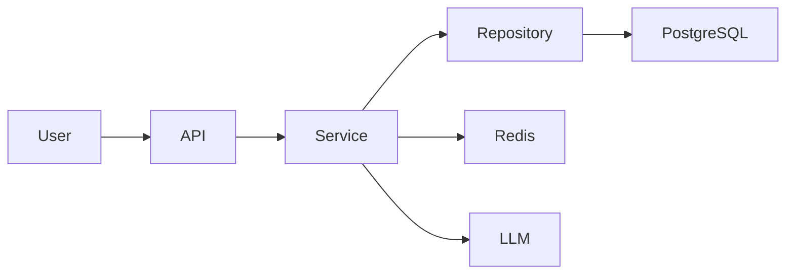

# dsh-project-brain 产品需求文档

**项目名称：** dsh-project-brain
**产品定位：** DSH 的持久化项目大脑（Local-First / 项目绑定 / 跨 Session 续接）
**版本：** v0.3.8（实现）/ 需求基线 v0.1
**状态：** v0.3.8 已就绪，等用户重启 DSH 后做最终验证
**目标用户：** 使用 DSH 进行长期软件开发的个人开发者与开发团队

---

## 0. 实现状态（v0.3.8 vs PRD v0.1）

### 已交付（P0 + P0.5 全部完成）

| PRD 章节 | 需求 | 状态 |
| --- | --- | --- |
| §2.1 Project Understanding | 自动分析项目结构 | ✅ scanner + build-time embed |
| §2.2 Persistent Project Memory | 项目级持久化记忆 | ✅ Memory V2 JSONL + active 状态过滤 + BM25/可选向量 Top-K |
| §2.3 Cross-Session Continuity | 跨 Session 续接 | ✅ Context Injector + project_continue |
| §2.4 Project Evolution | 持续演进 | ✅ Session 摘要（git diff） + 每次 update 写 timeline |
| §4.1 Project Overview | 项目元信息（名/类型/更新时间） | ✅ Header 区块 |
| §4.2 Tech Stack | 自动识别（Express/FastAPI/...） | ✅ scanner techStack 检测 |
| §4.3 Directory Explorer | 重要目录 | ✅ topLevel 列表 |
| §4.4 SidebarPreview | 侧边栏常驻入口 + 5 区块 + Onboarding + 行动按钮 | ✅ **8 区块**（超出原设计）+ 折叠 Dashboard |
| §5 Architecture | 系统架构图 | ✅ SidebarPreview CodeGraph 区块（局部版本） |
| §13 Session 摘要 | Session 结束自动归档 | ✅ summarizer |
| §14 Memory Lifecycle | importance + 合并/淘汰 | ✅ + project_dream light 模式 |

### 调整/延期（与原 PRD 的偏差）

| 偏差 | 原因 | 状态 |
| --- | --- | --- |
| 数据存储改用 **JSONL** 而非 SQLite | Local-First + git 友好 + 零依赖；规模未到 SQLite 阈值 | ✅ 调整 |
| 移除 SQLite / better-sqlite3 / storage-domain | 同上 | ✅ 调整 |
| SidebarPreview 5 区块 → **8 区块** | 实测发现 P0.4.1 加 TODO Top3 / Memories Top3 更实用 | ✅ 增强 |
| Dashboard 独立视图 → **折叠展开区** | 避免额外路由 + 简化维护 | ✅ 调整 |
| Vector 检索作为可选增强，不配置走本地 BM25 | 零配置可用、远程失败可降级 | ✅ V2 |
| `project_ask` v0.3.0 起加 `useLLM` 接 RAG | 之前是阉割版关键词 | ✅ 增强 |
| 移除 webServer live fetch（v0.3.0-v0.3.3） | static plugin fiber 不可用 | ⚠️ 回退 |

### 已知限制（v0.3.8）

- **host bundle 改动需重启 DSH**：DSH static plugin 加载到内存后不自动热重载
- **fetch 通道不可用**：v0.3.0-v0.3.3 验证 webServer route 在 static plugin fiber 不可用
- **沙箱与多 workspace 写**：DSH Desktop 下 `sandboxPolicy.workspaceRoot` 是 DSH 安装目录，工具默认写到那里（v0.3.8 修复）
- **TODO 角标无法实现**：`conversation.view` Slot 注册项无 badge 字段
- **DSH Desktop Electron 调试限制**：用户看不到 WebView 日志

### 验证状态

- 离线测试 `scripts/smoke-test.mjs`：**30/30 PASS**
- 构建：`lib/index.js` 109.2kb / `lib/client.js` 54.7kb
- 实测工作流：用户已截图确认 sidebar 显示 plugins 项目（绿色📦快照 + Header / Phase / Activity / Stats 渲染）
- 待重启 DSH 后验证：完整 8 区块 + Context Injector + summarizer + 项目 ask RAG + TODO strip

---

## 1. 项目背景

当前 AI Coding / Agent 开发存在几个典型问题：

1. Agent 第一次进入陌生项目时，需要反复扫描代码才能建立项目认知。
2. 项目架构、调用链、关键模块缺少统一、直观的展示。
3. 新开 Session 后，之前的开发上下文大量丢失。
4. Git 能记录“代码改了什么”，但无法很好记录“为什么这么改”。
5. 需求、架构决策、Bug、踩坑、TODO 等重要信息散落在 Session、Git Commit、Issue 和代码中。
6. 随着项目不断开发，AI 对项目的理解不能持续同步演进。

`dsh-project-brain` 希望解决以上问题：

> 让 DSH 不仅能够读取代码，而是真正形成一个能够长期演进的“项目大脑”。

它应该持续理解：

> **项目是什么 → 架构是什么 → 为什么这么设计 → 过去发生了什么 → 当前做到哪里 → 下一步应该做什么。**

---

# 2. 产品目标

dsh-project-brain 需要实现四个核心能力。

## 2.1 Project Understanding

自动分析整个项目，理解：

* 项目用途
* 技术栈
* 项目目录
* 模块职责
* 模块依赖
* 核心类 / 函数
* API
* 数据库
* 核心调用链
* 数据流
* 系统架构
* 开发入口

最终生成完整的 Project Dashboard。

---

## 2.2 Persistent Project Memory

持续沉淀项目中的重要知识：

* 架构设计
* 为什么这样设计
* 需求历史
* 技术决策
* 被放弃的方案
* Bug
* 踩坑经验
* 重要代码修改
* TODO
* 当前开发进度
* 已知问题

这些信息需要结构化保存，而不是简单保存聊天记录。

---

## 2.3 Cross-Session Continuity

实现真正的跨 Session 项目连续开发。

新 Session 启动后，DSH 应能够恢复：

* 项目整体信息
* 当前架构
* 最近开发内容
* 历史决策
* 当前任务
* 未完成任务
* 最近 Bug
* 相关代码
* 下一步开发计划

用户只需输入：

```text
继续上次的开发
```

DSH 即可恢复工作上下文，而不需要用户重新解释整个项目。

---

## 2.4 Project Evolution

Project Brain 不能是一次性生成的静态知识库。

它应该随着项目变化持续更新：

```text
代码变化
    ↓
Git Diff / Commit
    ↓
Project Brain 分析
    ↓
发现重要变化
    ↓
更新架构 / Memory / Timeline
    ↓
项目认知持续演进
```

最终形成一个长期成长的 Project Knowledge Model。

---

# 3. 核心使用场景

## 场景一：快速理解陌生项目

这是第一优先级场景。

用户进入一个从未接触过的项目：

```bash
/project init
```

系统自动：

1. 扫描整个代码仓库。
2. 分析项目技术栈。
3. 识别核心模块。
4. 建立代码依赖关系。
5. 分析主要调用链。
6. 分析数据流。
7. 生成系统架构图。
8. 生成目录说明。
9. 识别开发入口。
10. 生成 Project Dashboard。

目标：

> 让开发者在较短时间内建立对陌生项目的整体认知。

---

# 4. Project Dashboard

Dashboard 是 dsh-project-brain 的核心 UI。

首页至少包含以下模块。

## 4.1 Project Overview

展示：

```text
项目名称
项目简介
项目类型
主要业务
项目规模
主要语言
主要框架
启动方式
测试方式
部署方式
```

---

## 4.2 Tech Stack

自动识别：

```text
Frontend
Backend
Database
Cache
Message Queue
AI / LLM
Infrastructure
DevOps
Testing
```

例如：

```text
Backend
FastAPI

Database
PostgreSQL

Cache
Redis

LLM
Qwen / OpenAI

Vector DB
Milvus
```

---

## 4.3 Directory Explorer

展示重要目录及职责：

```text
src/
├── api/          API 层
├── services/     核心业务逻辑
├── repository/   数据访问
├── models/       数据模型
├── agents/       Agent 实现
├── prompts/      Prompt
└── utils/        公共工具
```

点击目录后可以继续查看：

* 目录职责
* 核心文件
* 主要类
* 主要函数
* 与其他模块关系

---

## 4.4 SidebarPreview（侧边栏常驻入口）

Dashboard 之外，dsh-project-brain 还需要在 DSH 主界面侧边栏顶部 tab 栏注册一个常驻入口，作为用户与"项目大脑"的日常接触点。

> **术语规范**：本节"SidebarPreview"是功能名；侧边栏 tab 元素本身叫"SidebarTab"。完整术语表见 `SPEC.md` 附录 E。

### 位置与形态

* **位置**：侧边栏顶部 tab 栏，紧邻"记忆库"右侧，与对话 / 轨迹 / 上下文 / 记忆库 形成第五个常驻 SidebarTab。
* **形态**：图标 + 标题，建议中文"项目"、英文"Project"。未激活态可挂角标（待办 TODO 数，>99 显示 `99+`），激活态展开 SidebarPreview 折叠面板。
* **打开方式**：点击切换；面板内任意位置可一键跳转到完整 Dashboard。

### 核心目的

> 让用户在打开 DSH 的第一秒，就能感知到"我现在在哪个项目、开发到哪里、下一步该做什么"，而无需主动输入 `/project status`。

### 折叠面板内容（5 区块 + Onboarding 状态）

```text
┌─────────────────────────────────────────┐
│ 🧠 dsh-project-brain                       │
├─────────────────────────────────────────┤
│ Header  项目：my-saas                     │
│         标签：FastAPI + PostgreSQL + Qwen│         上次更新：2 小时前            │
├─────────────────────────────────────────┤
│ Phase   当前阶段：Refresh Token 实现中    │
│         进度：▰▰▰▰▰▱▱▱▱  5 / 9          │
├─────────────────────────────────────────┤
│ Activity 最近活动                        │
│  · 14:32  完成 Redis Repository 重构     │
│  · 昨日   增加 Session 模型变更           │
│  · 2 天前 决策：用 Redis 存储 Session    │
├─────────────────────────────────────────┤
│ Stats   待办 3 · 已完成 12 · 决策 7      │
├─────────────────────────────────────────┤
│ Actions [ 继续上次开发 ] [ 打开 Dashboard ] │
└─────────────────────────────────────────┘
```

> `initialized=true` 时渲染 5 区块；`initialized=false` 时整个面板替换为 Onboarding 引导卡片。

### 信息层级

5 个区块 + 1 个状态：

| # | 区块/状态 | 数据来源 | 更新策略 |
| --- | --- | --- | --- |
| 1 | Header | `project.json`（name / tech_stack） | init 后基本不变 |
| 2 | Phase | 最近一条 `change` Memory + TODO 进度 | Session 结束时刷新 |
| 3 | Activity | Timeline 最近 N 条（默认 3） | 每次 Session 摘要后刷新 |
| 4 | Stats | Memory / TODO / Timeline count | 轻量聚合，秒级可算 |
| 5 | Actions | 触发 `/project continue` 与打开 Dashboard | 常驻 |
| — | Onboarding | 替代所有区块，仅 `initialized=false` 时显示 | init 后消失 |

### Onboarding（空状态）

未执行过 `/project init` 的项目，SidebarPreview 显示引导卡片：

```text
┌─────────────────────────────────────────┐
│ 🧠 项目大脑未启动                          │
├─────────────────────────────────────────┤
│ 这个项目还没有 Project Brain。             │
│ 启动后将自动生成：                         │
│   · 项目结构 / 技术栈 / 架构图            │
│   · 持续记录开发历史与决策                 │
│   · 跨 Session 自动恢复上下文             │
├─────────────────────────────────────────┤
│      [ 启动项目大脑 /project init ]        │
└─────────────────────────────────────────┘
```

主按钮触发 `/project init`，完成后 `initialized=true`，自动切换到正常态。

### 用户场景

* **场景 A — 进入 DSH 第一秒**：侧边栏一眼看到当前项目状态、最近做了什么、下一步要做什么。
* **场景 B — Session 切换时**：无需重新描述项目，preview 已总结出"上次开发到 Refresh Token"。
* **场景 C — 临时中断后回来**：点 "继续上次开发" 直接续接。
* **场景 D — 第一次进入陌生项目**：看到 Onboarding 卡片，知道有个"项目大脑"可以启动。

### 与 Dashboard 的关系

* **SidebarPreview 是浓缩摘要**，**Dashboard 是完整视图**。
* SidebarPreview 的每一个区块都是 Dashboard 对应面板的"跳转锚点"，点击直达对应 Tab。
* SidebarPreview 始终打开即用；Dashboard 是按需展开的深度视图。

### MVP 必须交付

- SidebarTab 注册（位置紧邻"记忆库"右侧，**Slot ID 在 P0.1 通过 `cordis_inspect_query` 确认**）。
- SidebarPreview 折叠面板渲染（5 区块）。
- Onboarding 状态卡片。
- "继续上次开发" / "打开 Dashboard" 两个行动按钮。
- SidebarTab 角标（待办 TODO 数，>99 显示 `99+`）。

### 详细规范

SidebarPreview 的数据契约、Pub/Sub、RPC 命名、性能目标、P0 验收清单等详见 `SPEC.md` §9。

# 5. Architecture

自动分析并生成项目架构。

至少支持：

## System Architecture

例如：



## Module Dependency

展示模块依赖关系。

## Data Flow

展示数据：

```text
从哪里来
↓
经过哪些模块
↓
如何处理
↓
最终到哪里
```

## Core Call Chain

例如：

```text
POST /chat
    ↓
ChatController
    ↓
ChatService
    ↓
AgentExecutor
    ↓
RAGService
    ↓
LLM
```

---

# 6. Code Intelligence

Project Brain 需要建立基础 Code Graph。

至少包含以下实体：

```text
Project
Directory
File
Module
Class
Function
API
DatabaseTable
Config
Dependency
```

关系包括：

```text
contains
imports
calls
inherits
implements
depends_on
reads
writes
exposes
```

通过这些关系支持：

```text
这个模块依赖谁？
谁调用这个函数？
修改这里影响哪些模块？
这个 API 最终访问了哪些数据库表？
这个功能的完整调用链是什么？
```

---

# 7. Project Memory

这是插件最核心的数据资产。

Memory 不应该简单保存聊天文本，而应该结构化。

Memory Type 至少包括：

```text
Architecture
Decision
Requirement
Change
Bug
Lesson
TODO
Issue
Context
```

---

# 8. Architecture Memory

记录重大架构变化。

示例：

```yaml
type: architecture

title: Authentication architecture changed

before:
  Controller -> Service -> DB

after:
  Controller -> Service -> Repository -> DB

reason:
  Decouple business logic and database access.

related_files:
  - src/auth/service.py
  - src/auth/repository.py

commit:
  abc123

created_at:
  2026-08-25
```

---

# 9. Decision Memory

不仅记录：

```text
用了什么技术
```

还必须记录：

```text
为什么使用
为什么不用其他方案
```

例如：

```yaml
type: decision

title: Use Redis for session storage

decision:
  Store session state in Redis.

reason:
  Local memory cannot share session state across multiple instances.

alternatives:
  - JWT
  - Local Memory

rejected:
  JWT

rejected_reason:
  Current permission invalidation mechanism requires server-side state.

related_files:
  - src/auth/session.py
```

这是 Project Brain 与普通代码索引工具的重要区别。

---

# 10. Requirement History

记录需求演进。

例如：

```text
2026-08-01

Requirement:
支持普通用户登录

↓

2026-08-10

Requirement Change:
支持多设备登录

↓

2026-08-15

Requirement Change:
支持管理员强制踢出 Session
```

使 Agent 能理解：

> 为什么当前代码会变成现在这个设计。

---

# 11. Bug / Lesson Memory

自动识别开发过程中的重要 Bug 和踩坑。

例如：

```yaml
type: lesson

problem:
  Redis connection occasionally failed.

root_cause:
  Connection pool was created for every request.

solution:
  Reuse global Redis connection pool.

related_files:
  - infrastructure/redis.py
```

以后遇到类似问题时，Agent 可以自动召回。

---

# 12. Development Change

每次 Session 结束后分析本次代码变化。

生成：

```text
本次开发

完成：
- 新增 Refresh Token
- 修改 Session 模型
- 增加 Redis Repository

重要变化：
- Authentication architecture changed

产生决策：
- Refresh Token 存储 Redis

遗留问题：
- 并发登录测试未完成

TODO：
- 增加 Session revoke API
```

不是所有代码 Diff 都进入长期 Memory。

只保存具有长期价值的重要变化。

---

# 13. TODO / Current State

Project Brain 必须明确知道：

```text
当前做到哪里
还有什么没做
下一步是什么
```

TODO 至少包括：

```text
title
description
status
priority
related_feature
related_files
created_at
source_session
```

状态：

```text
pending
in_progress
blocked
done
cancelled
```

---

# 14. Cross-Session

这是产品核心能力之一。

每次新 Session 创建时：

```text
New Session
    ↓
识别当前 Project
    ↓
加载 Project Brain
    ↓
选择相关 Memory
    ↓
注入必要 Context
    ↓
DSH 开始工作
```

不能把整个 Project Brain 全部塞进 Context。

需要根据：

```text
当前问题
当前模块
最近开发内容
当前 TODO
Memory Importance
Memory Recency
```

动态选择需要注入的记忆。

---

# 15. Continue Development

提供核心命令：

```bash
/project continue
```

系统自动输出：

```text
Project:
xxx

Last Development:
完成 Authentication Repository 重构

Current Status:
Refresh Token 功能开发中

Completed:
✓ Session Redis Storage
✓ Repository Layer

Pending:
○ Refresh Token
○ Concurrent Login Test
○ Session Revoke API

Important Decisions:
Redis stores session state

Known Issues:
Concurrent login behavior not fully verified

Suggested Next Step:
Continue implementing RefreshTokenService

Related Files:
src/auth/token_service.py
src/auth/session_repository.py
```

随后 Agent 自动获得相关上下文，可以直接继续开发。

---

# 16. Session Summary

每个 Session 结束时自动进行一次分析。

流程：

```text
Session Completed
       ↓
分析聊天记录
       ↓
分析 Git Diff
       ↓
分析代码变化
       ↓
提取重要信息
       ↓
Memory Classification
       ↓
写入 Project Brain
```

提取：

```text
Requirement
Decision
Architecture
Bug
Lesson
Important Change
TODO
```

---

# 17. Dream Mode

Dream Mode 是 Project Brain 的后台项目理解机制。

类似人类睡眠时整理长期记忆。

系统定时执行：

```text
/project dream
```

或者后台自动运行。

Dream 分析：

```text
Git Commits
Git Diff
Code Changes
Project Structure
Project Memory
Recent Sessions
TODO
Architecture
```

目标：

```text
发现新的重要变化
删除重复 Memory
合并相似 Memory
发现过期 Memory
发现架构变化
更新 Code Graph
更新 Architecture
更新 Dashboard
更新 Timeline
```

---

# 18. Memory Lifecycle

Memory 不能无限堆积。

生命周期：

```text
New
↓
Active
↓
Reinforced
↓
Outdated
↓
Archived
```

每条 Memory 可以拥有：

```text
importance
confidence
created_at
updated_at
last_accessed
source
status
```

Dream Mode 定期整理。

---

# 19. Source Traceability

任何重要 Memory 最好可以追溯来源。

来源包括：

```text
Session
Git Commit
Git Diff
Issue
PR
File
Function
User Input
```

例如：

```text
为什么系统用了 Redis？
```

系统回答后可以同时说明：

```text
Decision created:
2026-08-11

Source:
Session #231
Commit abc123

Related Files:
src/auth/session.py
```

避免 AI 产生无法验证的“项目记忆”。

---

# 20. Project Timeline

生成项目演进时间线。

例如：

```text
2026-07-01
项目创建

2026-07-10
增加 Authentication

2026-07-15
Session 使用 Local Memory

2026-08-01
发现多实例 Session 问题

2026-08-05
决定迁移 Redis

2026-08-10
完成 Redis Session

2026-08-20
增加 Repository Layer
```

Timeline 的价值是：

> 快速理解项目是如何一步一步演变成现在状态的。

---

# 21. Search / Ask Project Brain

提供自然语言查询：

```text
/project ask 为什么登录模块用了 Redis？

/project ask 用户登录完整调用链是什么？

/project ask 最近一个月架构发生了什么变化？

/project ask 之前踩过哪些 Redis 的坑？

/project ask 当前还有哪些 TODO？

/project ask 这个模块为什么这么设计？

/project ask 修改 UserService 会影响哪里？
```

---

# 22. Dashboard 信息架构

dsh-project-brain 在 DSH 中有两层 UI 表面：**SidebarPreview**（常驻入口）与 **Dashboard**（完整视图）。两者的信息架构如下。

> 术语：UI 元素叫 **SidebarTab**；空状态叫 **Onboarding**。完整术语表见 `SPEC.md` 附录 E。

## 22.1 SidebarPreview（侧边栏常驻入口）

由 SidebarTab 触发，位于 DSH 主界面侧边栏顶部 tab 栏，紧邻"记忆库"右侧。打开即用、常驻展示。

```text
SidebarPreview（initialized=true 时）
│
├── Project Identity    项目名 / 类型标签 / 上次更新时间    →  Dashboard / Overview
│
├── Current Phase       当前开发阶段 + 进度条            →  Dashboard / Tasks
│
├── Recent Activity     最近 3 条 Timeline 摘要          →  Dashboard / Timeline
│
├── Stats Summary       待办数 / 已完成数 / 决策数        →  Dashboard / Memory / Tasks
│
└── Quick Actions       继续上次开发 / 打开 Dashboard    →  触发 Tool / 路由

Onboarding（initialized=false 时，整面板替换）
└── 引导卡片 + 启动 /project init 按钮
```

## 22.2 Dashboard（完整视图）

由 SidebarPreview 任意处跳转进入，提供深度浏览与编辑能力。

```text
Project Brain
│
├── Overview
│
├── Architecture
│   ├── System
│   ├── Modules
│   ├── Data Flow
│   └── Call Chain
│
├── Code Map
│
├── Memory
│   ├── Decisions
│   ├── Requirements
│   ├── Bugs
│   ├── Lessons
│   └── Changes
│
├── Timeline
│
├── Tasks
│
├── Sessions
│
└── Dream
```

## 22.3 两层之间的关系

| 维度 | SidebarPreview | Dashboard |
| --- | --- | --- |
| 入口位置 | SidebarTab，紧邻"记忆库"右侧 | SidebarPreview 内跳转 / 命令打开 |
| 内容深度 | 摘要（5 区块 + Onboarding 状态） | 完整（10 个主面板） |
| 渲染开销 | 低（聚合数据） | 中（大量数据 + 交互） |
| 触发频率 | 进入 DSH 即看 | 按需展开 |
| 编辑能力 | 无（只读 + 行动按钮） | 完整读写 |

每个 SidebarPreview 区块都是 Dashboard 对应面板的"跳转锚点"。

---

# 23. MVP 范围

第一阶段不要一次实现全部能力。

MVP 重点验证：

> Project Brain 是否真的能帮助开发者快速理解项目，并跨 Session 持续开发。

MVP 必须完成以下能力。

## P0

### `/project init`

实现：

* 项目扫描
* 技术栈识别
* 目录理解
* 核心模块识别
* 基础 Code Graph
* 系统架构生成
* 调用链识别
* Project Dashboard

### Project Memory

支持：

```text
Decision
Architecture
Bug
Lesson
Change
TODO
```

### Session Memory

Session 结束自动：

```text
总结
↓
提取重要变化
↓
写入 Project Brain
```

### Cross-Session

新 Session 自动恢复：

```text
Project Summary
Recent Changes
Important Decisions
Current TODO
Current Development State
```

### `/project continue`

直接恢复之前开发状态。

### SidebarPreview

侧边栏常驻入口（紧邻"记忆库"右侧）：

* SidebarTab 注册（Slot ID 在 P0.1 通过 `cordis_inspect_query` 确认）
* SidebarPreview 折叠面板渲染（5 区块：Header / Phase / Activity / Stats / Actions）
* Onboarding 状态卡片（项目未 init 时整面板替换）
* SidebarTab 角标（待办 TODO 数，>99 显示 `99+`）
* "继续上次开发" / "打开 Dashboard" 两个行动按钮
* 区块点击跳转 Dashboard 对应面板

---

# 24. V2

增加：

* Git Commit 深度分析
* Project Timeline
* Requirement History
* Impact Analysis
* Memory Source Trace
* Memory Confidence
* Dashboard 完善
* Architecture Diff

---

# 25. V3

增加 Dream Mode：

* 定时扫描项目
* 自动重建 Code Graph
* 自动检测架构变化
* Memory 合并
* Memory 去重
* Memory 失效检测
* 自动生成项目演进报告

---

# 26. 数据存储建议

原则：

> 项目知识跟项目绑定，而不是跟 Session 绑定。

建议目录：

```text
.project-brain/
│
├── project.json
│
├── architecture.json
│
├── codegraph.db
│
├── memory.db
│
├── timeline.db
│
├── sessions/
│
├── snapshots/
│
└── config.json
```

其中：

```text
SQLite
```

适合保存结构化实体、关系、Memory、Timeline。

Markdown / JSON 可以用于：

* 可读快照
* Git Version Control
* 导入导出

---

# 27. 项目知识模型

核心关系：

```text
Project
   │
   ├── HAS_MODULE
   ▼
Module
   │
   ├── HAS_FILE
   ▼
File
   │
   ├── DEFINES
   ▼
Symbol

Symbol ── CALLS ──> Symbol

Module ── DEPENDS_ON ──> Module

Decision ── RELATED_TO ──> Module

Bug ── RELATED_TO ──> File

Requirement ── IMPLEMENTED_BY ──> Module

Change ── CAUSED_BY ──> Requirement

TODO ── RELATED_TO ──> File
```

最终实际上形成的是一个：

> **Project Knowledge Graph**

---

# 28. 非功能需求

## 性能

初次分析大型项目时允许耗时较长。

日常 Session 不应该每次重新扫描整个项目。

采用：

```text
Full Scan
+
Incremental Update
```

---

## Token 成本

尽量避免：

```text
每次把整个项目发给 LLM
```

应该优先：

```text
AST / Tree-sitter
Git Diff
Static Analysis
Code Graph
```

先筛选信息，再交给 LLM 理解。

---

## 隐私

默认：

```text
Local First
```

Project Brain 数据保存在本地。

不得默认上传：

* 源代码
* Memory
* Git History
* 项目文档

---

# 29. 核心设计原则

### Principle 1

**不要记住所有东西，只记住长期有价值的东西。**

### Principle 2

**不要只记录 What，还要记录 Why。**

### Principle 3

**项目知识属于 Project，而不是 Session。**

### Principle 4

**Project Brain 必须随着代码持续演进。**

### Principle 5

**所有重要知识尽可能可追溯。**

---

# 30. 核心产品闭环

整个系统最重要的闭环：

```text
首次进入项目
     ↓
理解项目
     ↓
建立 Project Brain
     ↓
开始开发
     ↓
产生代码 / 需求 / 决策
     ↓
自动分析
     ↓
沉淀重要 Memory
     ↓
更新架构和当前状态
     ↓
Session 结束
     ↓
新 Session
     ↓
SidebarPreview 一眼呈现"上次到哪、下一步做什么"
     ↓
恢复 Project Brain
     ↓
继续开发
     ↓
持续循环
```

最终目标：

> **项目开发时间越长，DSH 对项目的理解应该越深，而不是每一个 Session 都重新开始。**

---

# 31. 核心验收标准

MVP 达到以下效果即可认为核心方向成立：

1. 对一个陌生项目执行 `/project init` 后，可以生成较准确的项目说明、技术栈、目录结构、核心模块和架构图。
2. 完成一次真实功能开发后，系统能够自动识别并沉淀重要 Decision、Change、Bug、Lesson 和 TODO。
3. 关闭当前 Session，新建 Session 后无需重新描述项目，`/project continue` 可以恢复上一轮开发状态。
4. 用户询问“为什么这里这样设计”时，可以结合历史 Decision 给出答案，而不仅仅根据当前代码猜测。
5. 项目持续修改后，Project Brain 能够通过增量更新保持与当前代码状态基本一致。
6. 打开 DSH 后，侧边栏 SidebarTab "项目" 立即呈现当前项目状态、最近 3 条活动、待办进度；未初始化的项目显示 Onboarding 引导卡片。

---

# 32. 产品一句话

> **dsh-project-brain 是 DSH 的持久化项目大脑：理解代码架构、记住项目历史、跨 Session 保持上下文，并随着项目持续成长。**

英文：

> **A persistent project brain for DSH — understand the codebase, remember the history, and continue development across sessions.**

---

# 33. 变更日志（v0.1 → v0.3.8）

| 版本 | 日期 | 关键变化 | 原因 |
| --- | --- | --- | --- |
| v0.1 | 初版 | PRD 原始规格 | — |
| v0.2 | 评审后 | TS-as-contract 提示；Slot ID 提前到 P0.1；SQLite PRAGMA；fixture 拆 P0.0；编码规约放宽 | 评审反馈 |
| v0.2.1 | P0.1 Inspect | SidebarPreview 实际是 `conversation.view`；主题 token 前缀 `--dsw-*` | Inspect 实测 |
| v0.2.2 | P0.4.1 | 8 工具 + Stats 真实数据 + TODO + Dashboard 展开区 | 完成 §7 工具面 |
| v0.2.3 | P0.4.2 回路 | `conversation.view` 无 badge 字段 → 改 Dashboard 内展示 | Inspect 实测 |
| v0.2.4 | P0.4.2 | host route 失败 → 回退 | 用户截图 |
| v0.2.5 | P0.4.2-final | build-time embed 多 workspace | 用户三次反馈 |
| v0.2.6 | P0.4.8 | scanner 修复 FsDirEntry.type | dryRun 实测 |
| v0.2.7 | P0.4.9 | path-resolver 跨项目隔离 | memory c74219ab |
| v0.2.8 | P0.5 | session/disposed → git diff → change memory | SPEC §16 |
| v0.2.9 | P0.5.x | 工具面补全（status/todo_update/ask/dream）→ 12 工具 | 用户"开发完所有功能" |
| **v0.3.0** | 架构重做 | webServer live fetch（**已回退**） | 用户指出"实时同步"核心需求 |
| **v0.3.1** | PromptSection 修复 | `render` → `text` | indexOf 崩溃 |
| **v0.3.2** | Electron 诊断 | LiveBadge 显示真实错误 + hit-marker | 用户截图 404 |
| **v0.3.3** | 路径重试 | prefix + 独特命名空间 | 仍然 404 |
| **v0.3.4** | 完整回退 | 放弃 webServer，回到 build-time embed + auto-rebuild | 浏览器也 404 |
| **v0.3.5** | build.js | findBrainsUnder 排除 plugin 自己（cordis.patch.yml） | sidebar 错显示 plugin 项目 |
| **v0.3.6** | tools schema | 补全 `path` 参数；output schema 改 true | 修复"value.code not declared" |
| **v0.3.7** | sandbox 写权限 | brain-files 默认 danger-full-access | 修复 E_WRITE_FAILED |
| **v0.3.8** | path-resolver 完整修复 | workspaceRegistry 优先 + 跳过 DSH Desktop | 工具写到 DSH 安装目录 bug |

---

# 34. 与 SPEC.md / TODO.md / README.md / DESIGN.md 对应

- **SPEC.md**：技术规格、PromptSection 合约、版本路由、Changelog 详细信息
- **TODO.md**：执行状态 + 各阶段勾选 + Inspect 归档（Host/Client Services + Slot 表）
- **README.md**：用户视角使用指南（安装、使用、调试、已知限制）
- **DESIGN.md**：设计意图、架构图、关键决策表、风险表（v0.3.8 已重写）
