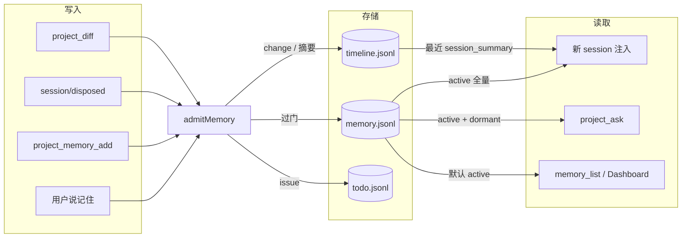
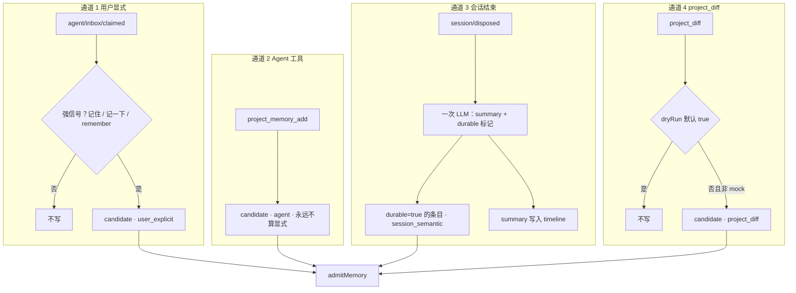
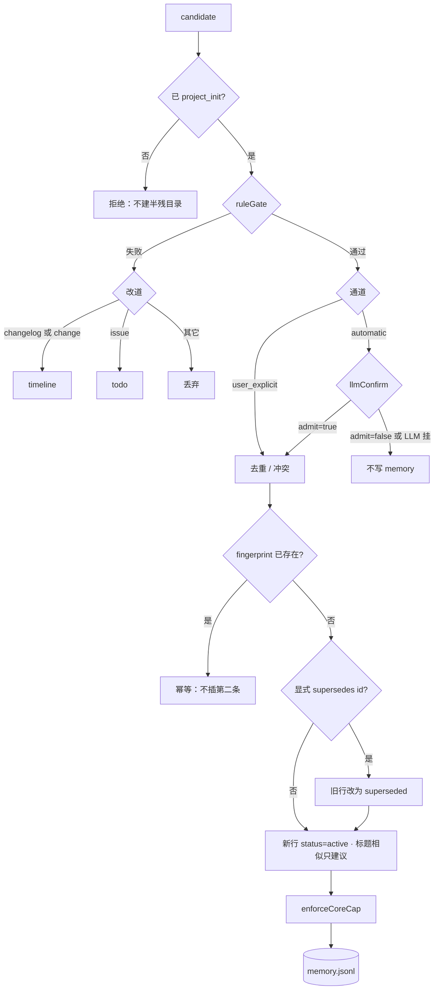
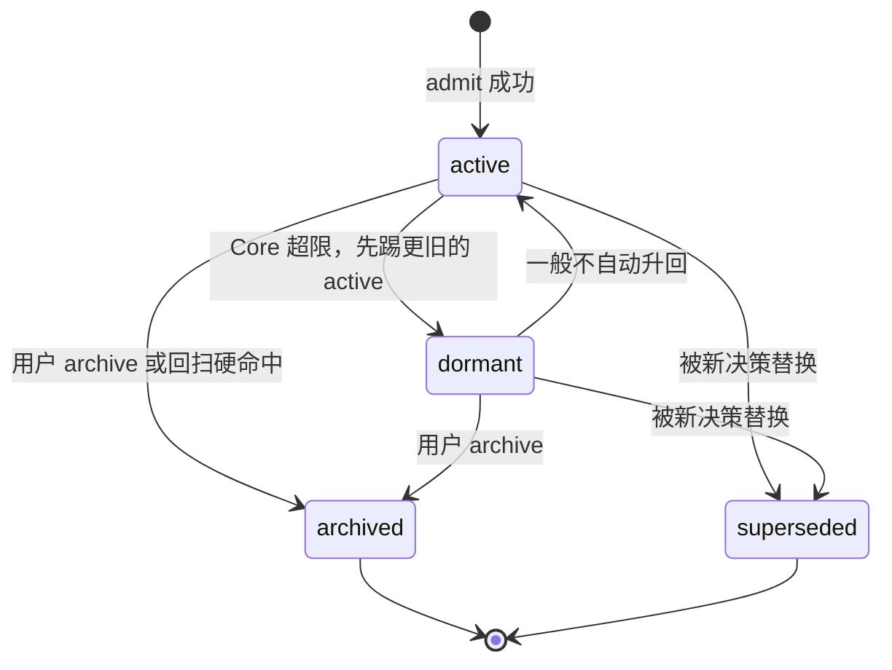
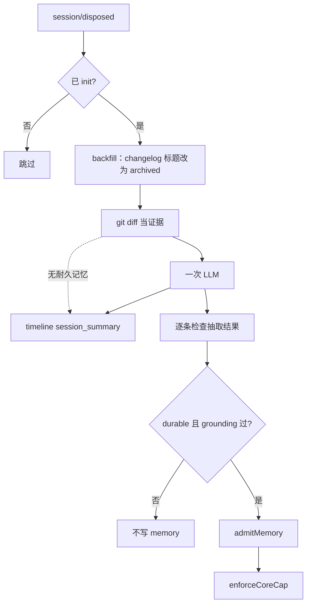
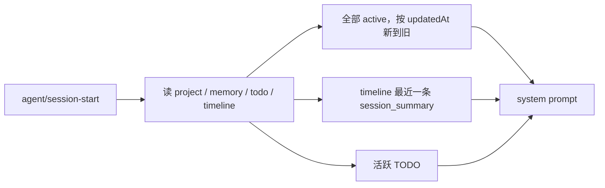
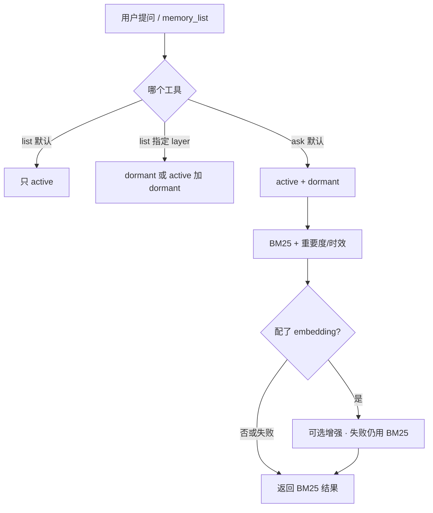
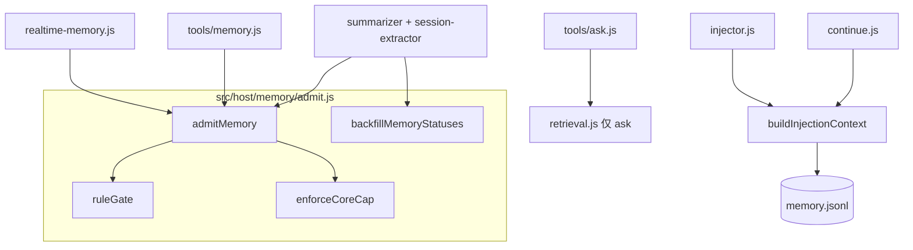
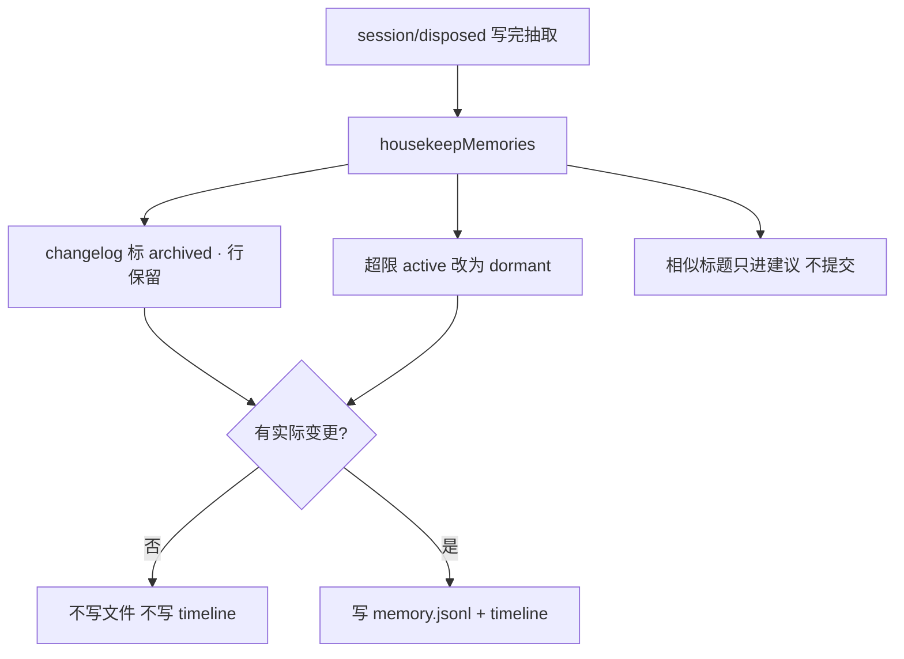

# Durable Core Memory 链路图

对应设计：[2026-09-15-durable-core-memory-design.md](./2026-09-15-durable-core-memory-design.md)

一句话：所有写入进同一扇门 `admitMemory()`；能进 prompt 的只有 Core（`active`）加上 timeline 里的上次会话摘要。

---

## 1. 总览

左边写、中间存、右边读。**写 `memory.jsonl` 事实行只有 `admitMemory`。** `project_diff` / 抽取 / 工具 / 记住 全部进这扇门。向量缓存是派生数据，注入不用。



---

## 2. 四条写入通道

只有用户原话「记住」免 LLM。Agent 工具、会话抽取、`project_diff` 都是自动通道，必须过门。mock 禁止落盘。



弱信号（以后都 / 约定）**当场不写**，最多等通道 3 的 LLM 判断是否耐久。

---

## 3. admitMemory 门

所有通道共用。规则一票否决；LLM 不能推翻规则失败。



规则门硬拒绝（可单测）：

- type 不在 `decision | requirement | architecture | bug | lesson`（`context` 仅 `user_explicit`）
- 标题/正文像 changelog（版本号、patch、文件清单、「本次改了 N 个文件」）
- 正文过短，或整段只是本次活动报告（不是标题里出现「刚才」就拒绝）

---

## 4. 状态机

写入成功后只有调度，没有「注入时再截断」。



| status | 含义 | 注入 | ask |
| --- | --- | --- | --- |
| `active` | Core | 全部 | 是 |
| `dormant` | 合格但挤出 Core | 否 | 是 |
| `archived` | 不合格 / 否决 | 否 | 默认否 |
| `superseded` | 已被替换 | 否 | 默认否 |

`archived` ≠ `dormant`：changelog 进 archived；旧但仍为真的决策进 dormant。

---

## 5. 会话结束（summarizer）

Git 只当证据，不再生成 `type=change` 记忆。



---

## 6. 新会话注入

`injector` 和 `project_continue` 共用 `buildInjectionContext()`。不走向量、不做空 query 的 Top-K。



Prompt 结构：

```text
## Project Brain
### 项目概况
### Core 记忆      ← 只 active，全量，写入时已限 15 / 800 token
### 上次会话      ← 只摘要，不进 memory.jsonl；没有则整段省略
### 活跃 TODO
```

---

## 7. 按需检索（ask / list）



注入 **不** 走这张图。所以不会再出现「list 一套分、prompt 另一套分」。

---

## 8. 模块落点



---

## 9. Dream：只收拾，不删决策

不是睡觉时再抽一层记忆。会话抽取已经是反射。自动路径禁止标题相似就删行。



手动 `project_dream` 默认 dry-run，确认后只执行上图的归档 + evict，仍然不 Jaccard 删除。

---

## 10. 读这张图时记住的三句话

1. **能进 `memory.jsonl` 的，必须像半年后仍为真的句子。** 发版说明、文件清单、本次改了什么，只进 timeline。
2. **门在写入时关死，不在注入时碰运气。** Core 超限先踢旧的 active；本轮新写入免驱逐。不合格 → `archived`；只有显式 supersede 才替换。收拾房间不删决策。
3. **新 session 只带 Core + 上次摘要。** 旧决策要回顾，用 `project_ask` 搜 dormant，不要把档案塞进 system prompt。
