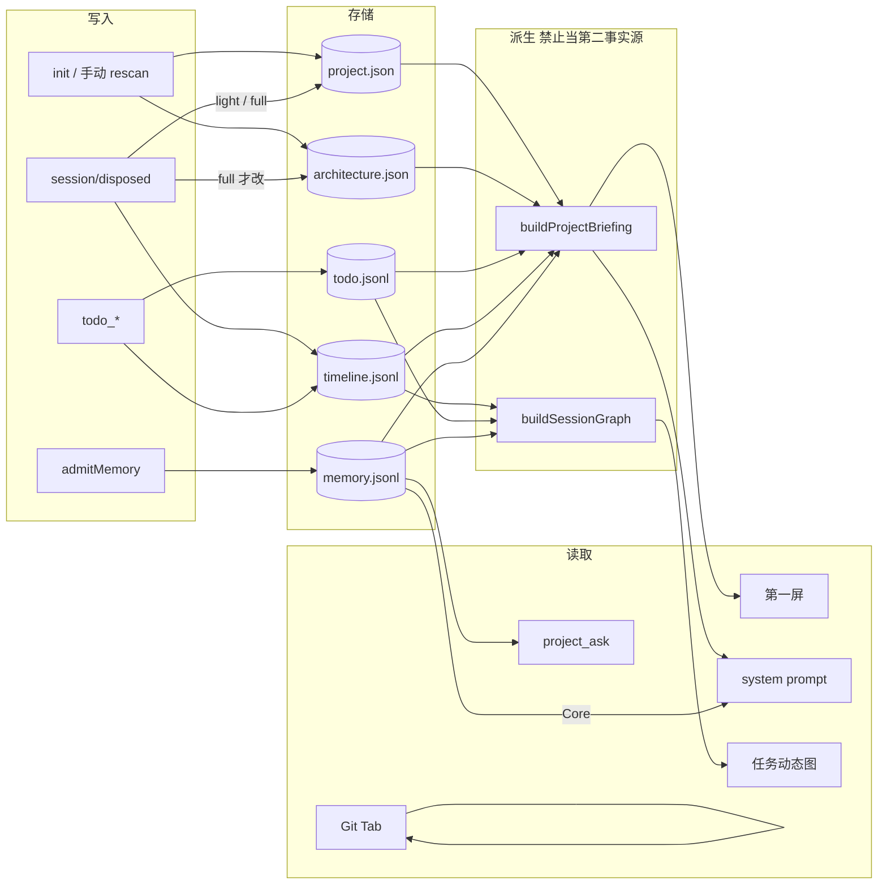
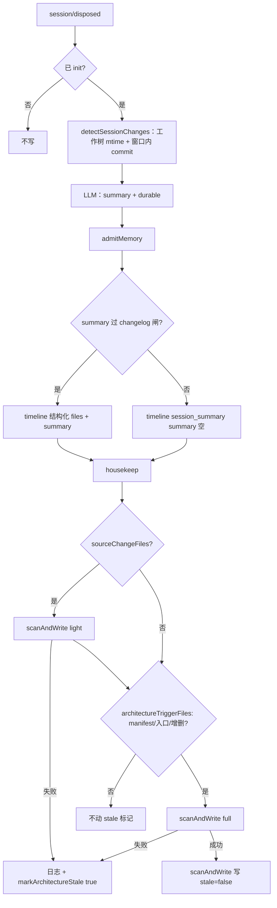
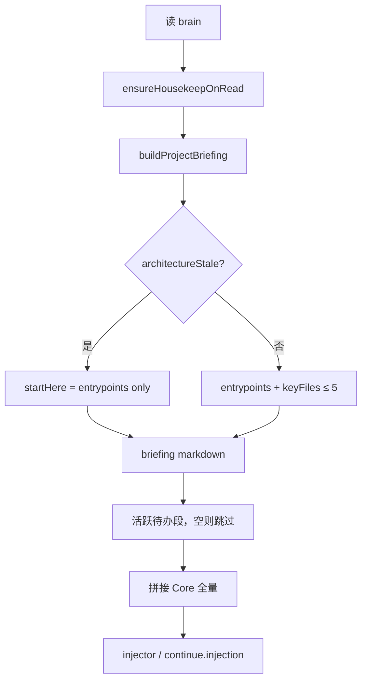
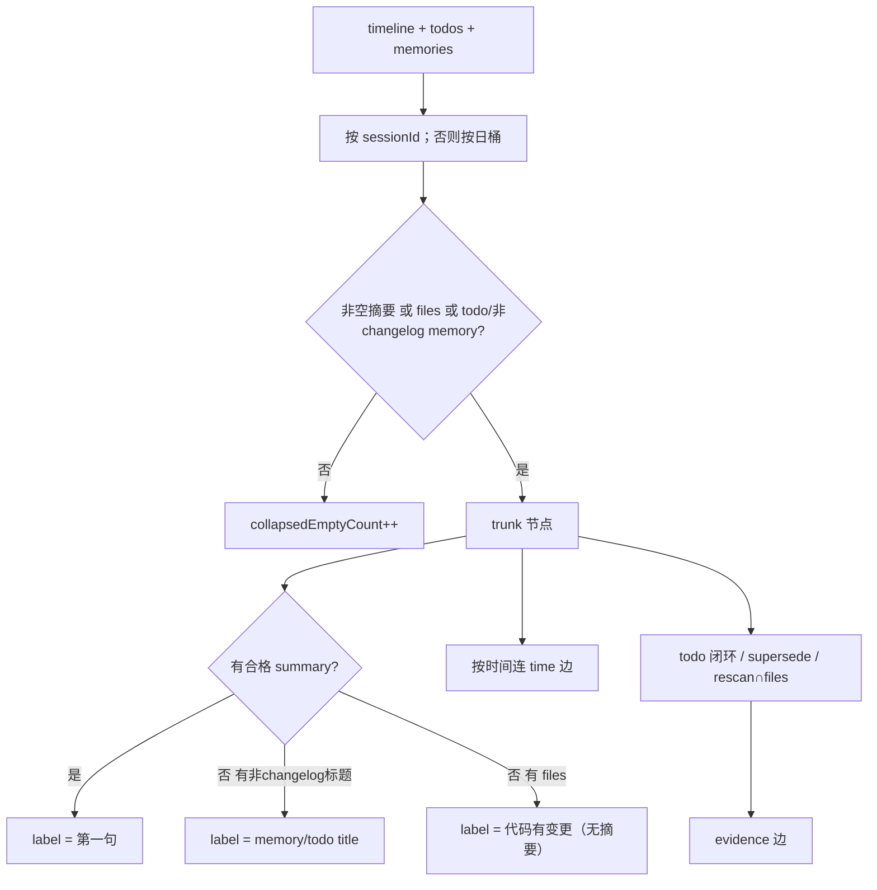

# Project Familiarity 链路图

对应设计：[2026-09-18-project-familiarity-design.md](./2026-09-18-project-familiarity-design.md)

一句话：`.project-brain/` 仍是唯一事实源；人第一屏和 Agent 注入共用 `buildProjectBriefing`；变更史是派生图，不是新库。

---

## 1. 读写总览

---

## 2. Session 结束

---

## 3. 注入组装

---

## 4. 主干图派生

